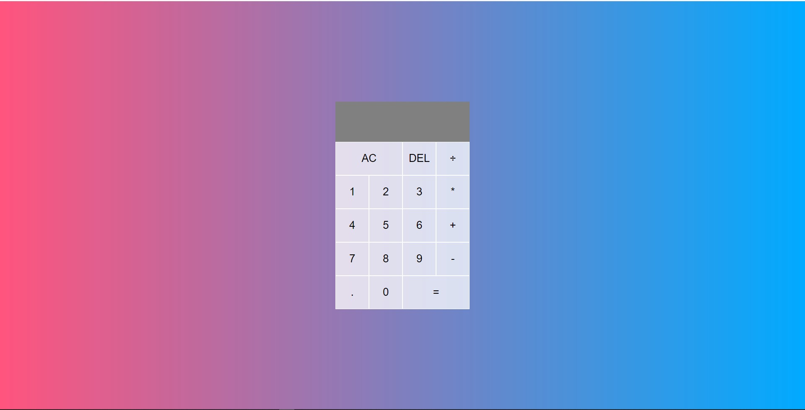
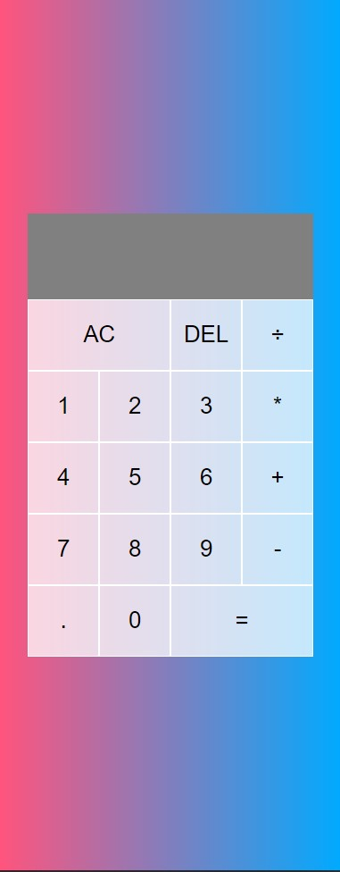

  

# This is a Calculator Project

> This is a fully functioning calculator which can help you with basic calculations.

## Built With

- CSS & HTML
- CSS Grid
- CSS Flexbox
- Github
- Javascript

## Getting Started

## Deployment

You can review the live site [here](https://olamarx.github.io/Calculator/)

## Author

👤 **Owoeye Olaoluwa (Olamarx)**

- GitHub: [@githubhandle](https://github.com/Olamarx)
- Twitter: [@twitterhandle](https://twitter.com/Owoeye0laoluwa)
- LinkedIn: [LinkedIn](https://www.linkedin.com/in/olaoluwa-owoeye-617702162/)
- Facebook: [Facebook](https://web.facebook.com/olaoluwa.owoeye.39)

## 🤝 Contributing

Contributions, issues, and feature requests are welcome!

Feel free to check the [issues page](https://github.com/Olamarx/Calculator/issues).

## Show your support

Give a ⭐️ if you like this project!

## Acknowledgments

Special thanks to:

[Web Dev Simplified](https://www.youtube.com/channel/UCFbNIlppjAuEX4znoulh0Cw)

## 📝 License

<!-- This project was inspired and aproved by [Microverse](https://www.microverse.org). -->
